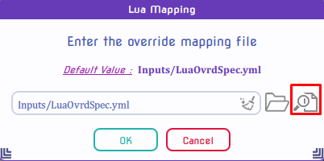
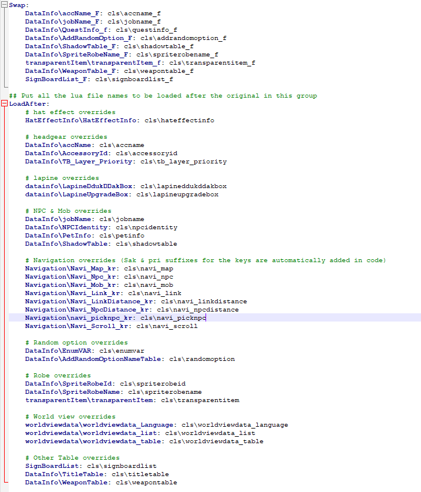
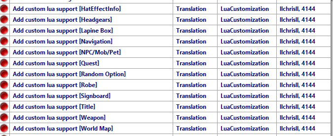

# Addons and Customization

Here I will explain what the [Addons](https://github.com/llchrisll/ROenglishRE/tree/master/Addons) folder contains and how it works:  
In most cases the original files only have to be overwritten, if not explained otherwise.

## [jRO Enchants Display](https://github.com/llchrisll/ROenglishRE/tree/master/Addons/jRO%20Enchants%20Display)
kRO doesn't have these Enchantment Prefixes like jRO has, so I made it optionally via seperate folder.

In case you don't know what I mean with `Enchantment Prefixes`:
- Enchantments are like Cards, but for kRO they don't have any entries in these files, so they won't be recognized as such.
- jRO on the other hand, added Prefixes for them to show like `<Fighting Spirit7>` for ID 4822 in the Equipment Name, just like Cards.

## [Custom Lua Support](https://github.com/llchrisll/ROenglishRE/tree/master/Addons/Custom%20Lua%20Support)
The Custom Lua Support (or CLS) was created to assist you further in adding your custom entries to seperate files, split from the original files, so it's easier to update the translation files. It's similar to the Multi-Iteminfo Support, but on a bigger scale.

**Important Note:**
Be aware that mose of these files are only tested for lua errors and functionality regarding the original files.  
In case you encounter errors, please use the discord for reporting it and PM me with your custom stuff so I can test them efficiently.
  **_Before using any of these files be sure to make a backup of your original clients/files. You have been warned!_**

Installation:

1. Copy & Paste the `Custom Lua Files/data` in your own folder and insert the custom entries/values from the current files into the new ones in `data/luafiles514/lua files/cls` folder, the same way as you did before.  
2. Afterwards you add the `data/luafiles514/lua files/cls` folder in your GRF and your are done.
3. Apply the patches via WARP or NEMO; See below for details.
4. Test it and report any issues you might experience.

Tested Files

* Mob/NPC/Pets  
* Headgear  
* Weapon  
* Title Table (Required Modify [TITLE_MAX](https://github.com/rathena/rathena/blob/eadfa053f6db830e0e769b7241aab5b8df651c92/src/map/achievement.hpp#L69))

Files which I'm not gonna test

* DrawItemonAura  
* Random Options  
* Shadow Table  
* TB_Layer_Priority  
* HatEffectInfo  
* LapineBoxes

Update: As of [31st August 2024](https://github.com/llchrisll/ROenglishRE/commit/d5f4a47957f51a82454c8cf05f255e6db7009a16), I moved the CLS for quests to the Additions folder as they can't make use of this anyway.  
To make use of that, start the `Tools/AdditionsGenerator.bat`.

### WARP
  
The patch will open an input window, where that config file is located and you can open it in your text editor as well. 
  
In this file you can decide which the paths should be applied and which not: 
If you want to disable certain entries, put an `#` in front of them. 

* Swap  
This is to replace the original kRO functions with my customized version located in the `cls` folder.  
As they contain some heavy edits, which prevents overwriting the original functions.

* LoadAfter  
This is to load the files in the `cls` folder additionally to the original files.

Below you can find a list, which files are connected with each other to prevent any errors.

* HatEffect  
    - HatEffectInfo\HatEffectInfo: cls\hateffectinfo
* Headgear
    - DataInfo\accName_F: cls\accname_f  
    - DataInfo\accName: cls\accname  
    - DataInfo\AccessoryId: cls\accessoryid  
    - DataInfo\TB_Layer_Priority: cls\tb_layer_priority
* NPC/Mob/Pet  
    - DataInfo\jobName_F: cls\jobname_f
    - DataInfo\jobName: cls\jobname
    - DataInfo\NPCIdentity: cls\npcidentity
    - DataInfo\PetInfo: cls\petinfo
    - DataInfo\ShadowTable_F: cls\shadowtable_f
    - DataInfo\ShadowTable: cls\shadowtable
* Random Options  
    - DataInfo\AddRandomOption_F: cls\addrandomoption_f
    - DataInfo\EnumVAR: cls\enumvar
    - DataInfo\AddRandomOptionNameTable: cls\randomoption
* Lapine Boxes  
    - datainfo\LapineDdukDDakBox: cls\lapineddukddakbox
    - datainfo\LapineUpgradeBox: cls\lapineupgradebox
* Navigation  
    - Navigation\Navi_Map_kr: cls\navi_map
    - Navigation\Navi_Npc_kr: cls\navi_npc
    - Navigation\Navi_Mob_kr: cls\navi_mob
    - Navigation\Navi_Link_kr: cls\navi_link
    - Navigation\Navi_LinkDistance_kr: cls\navi_linkdistance
    - Navigation\Navi_NpcDistance_kr: cls\navi_npcdistance
    - Navigation\navi_picknpc_kr: cls\navi_picknpc
    - Navigation\Navi_Scroll_kr: cls\navi_scroll
* Robes (Costume Garments)  
    - DataInfo\SpriteRobeName_F: cls\spriterobename_f
    - DataInfo\SpriteRobeId: cls\spriterobeid
    - DataInfo\SpriteRobeName: cls\spriterobename
    - transparentItem\transparentItem: cls\transparentitem
    - transparentItem\transparentItem_f: cls\transparentitem_f
* Weapons  
    - DataInfo\WeaponTable: cls\weapontable
    - DataInfo\WeaponTable_F: cls\weapontable_f
* Signboard  
    - SignBoardList_F: cls\signboardlist_f
    - SignBoardList: cls\signboardlist
* World Map  
    - worldviewdata\worldviewdata_Language: cls\worldviewdata_language
    - worldviewdata\worldviewdata_list: cls\worldviewdata_list
    - worldviewdata\worldviewdata_table: cls\worldviewdata_table
* Titles  
    - DataInfo\TitleTable: cls\titletable

### NEMO
4144 still has to code a different logic to make the Custom Navigation and World Map Support work, but everything else works so far: 
Just apply the patches you want and it should work! 

## [Navigation Legacy](https://github.com/llchrisll/ROenglishRE/tree/master/Addons/Navigation%20Legacy)
As of commit [3rd April 2022](https://github.com/llchrisll/ROenglishRE/commit/4b8cc693b6491bc9edea70b7622364ba0750acf0) I moved the previous Navigation files into `Addons/Navigation Legacy`.
Because this commit removes them of the Renewal folder and introduces an modified `navi_f_krpri.lub` and `navi_f_krsak.lub` in combination of an extra file: `SystemEN/Navi_Data.lub`
This file contains the korean text and the translated counterpart for it.

The result of the whole process is that I can skip then tiring process of syncing the ID's kRO uses for their navigation, which mostly changes with each update they do regarding it and only focus on translating the words.
But that also means that the client also reads the kRO files instead, which might not match the emulator content.

For this reason I moved the previous navigation files into `Addons/Navigation Legacy` folder.
Just place those files in the `data/luafiles514/lua files/navigation/` folder again and you have the previous setup. But still use the new `SystemEN/Navi_Data.lub` as well.

## [Signboard Legacy](https://github.com/llchrisll/ROenglishRE/tree/master/Addons/Signboard%20Legacy)
As I removed the `signboard.lub` file from the project with [8th April 2022](https://github.com/llchrisll/ROenglishRE/commit/e85d3883a7822308008bcbef3877d5ab25fff21f) and implemented the `SystemEN/Sign_Data.lub` as well as the edited `signboard_f.lub` file, I decided recently ([22 March 2023](https://github.com/llchrisll/ROenglishRE/commit/6e08f70384572d64af25eea6176ca4a69999cf05)) to re-upload the old `signboardlist.lub` seperatly as well.

## [Revised Pre-Renewal Skill Info](https://github.com/llchrisll/ROenglishRE/tree/master/Addons/Revised%20Pre-Re%20SkillInfoz)
This skilldescript.lub contains revised skill descriptions for pre-renewal,  
containing comments how the skill works and how effects like stats are calculated.

[rAthena Thread](https://rathena.org/board/topic/139880-pre-renewal-skill-translations-and-tooltips-improved-revised-re-edited-and-commented-by-sandalphon/)  
Author: sandalphon