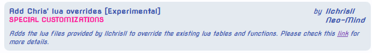
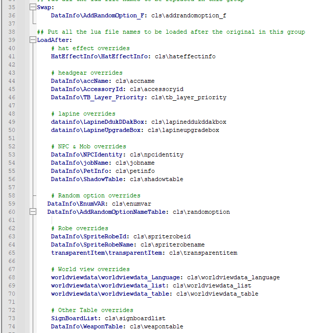
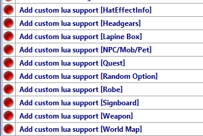

# Addons and Customization

Here I will explain what the [Addons](https://github.com/llchrisll/ROenglishRE/tree/master/Addons) folder contains and how it works:  
In most cases the original files only have to be overwritten, if not explained otherwise.

## [jRO Enchants Display](https://github.com/llchrisll/ROenglishRE/tree/master/Addons/jRO%20Enchants%20Display)
kRO doesn't have these Enchantment Prefixes like jRO has, so I made it optionally via seperate folder.

In case you don't know what I mean with `Enchantment Prefixes`:
- Enchantments are like Cards, but for kRO they don't have any entries in these files, so they won't be recognized as such.
- jRO on the other hand, added Prefixes for them to show like `<Fighting Spirit7>` for ID 4822 in the Equipment Name, just like Cards.

## [Custom Lua Support](https://github.com/llchrisll/ROenglishRE/tree/master/Addons/Custom%20Lua%20Support)
The Custom Lua Support (or CLS) was created to assist you further in adding your custom entries to seperate files, split from the original files, so it's easier to update the translation files. It's similar to the Multi-Iteminfo Support, but on a bigger scale.

**Important Note:**
Be aware that mose of these files are only tested for lua errors and functionality regarding the original files.  
In case you encounter errors, please use the discord for reporting it and PM me with your custom stuff so I can test them efficiently.
<br/><br/>**_Before using any of these files be sure to make a backup of your original clients/files. You have been warned!_**

Installation:

1. Copy & Paste the `Custom Lua Files/data` in your own folder and insert the custom entries/values from the current files into the new ones in `data/luafiles514/lua files/cls` folder, the same way as you did before.  
2. Afterwards you add the `data/luafiles514/lua files/cls` folder in your GRF and your are done.
3. Apply the patches via WARP or NEMO; See below for details.
4. Test it and report any issues you might experience.

Tested Files

* Mob/NPC/Pets  
* Headgear  
* Weapon  
* Random Options  
* Shadow Table  
* HatEffectInfo  
* LapineBoxes

Files which I'm not gonna test

* DrawItemonAura  
* TB_Layer_Priority  

Update: As of [31st August 2024](https://github.com/llchrisll/ROenglishRE/commit/d5f4a47957f51a82454c8cf05f255e6db7009a16), I moved the CLS for quests to the Additions folder as they can't make use of this anyway.  
To make use of that, start the `Tools/AdditionsGenerator.bat`.

### WARP
  
The patch will open an input window, where that config file is located and you can open it in your text editor as well.<br/>
<br/><br/>
In this file you can decide which the paths should be applied and which not:<br/>
If you want to disable certain entries, put an `#` in front of them.<br/>


Update: Duo to the recent changes [18th January 2025](https://github.com/llchrisll/ROenglishRE/commit/37bab01813ce141f2de4123c9e59d2535ebe82ad) the original file will look different than shown above,  
until WARP updates from my PR.
So until the PR were merged or the files updated, please use this to overwrite it:  
**Note**: This will be deleted afterwards of course.

```
Swap:
    DataInfo\AddRandomOption_F: cls\addrandomoption_f

## Put all the lua file names to be loaded after the original in this group
LoadAfter:
    # hat effect overrides
    HatEffectInfo\HatEffectInfo: cls\hateffectinfo
    
    # headgear overrides
    DataInfo\accName: cls\accname
    DataInfo\AccessoryId: cls\accessoryid
    DataInfo\TB_Layer_Priority: cls\tb_layer_priority
    
    # lapine overrides
    datainfo\LapineDdukDDakBox: cls\lapineddukddakbox
    datainfo\LapineUpgradeBox: cls\lapineupgradebox
    
    # NPC & Mob overrides
    DataInfo\NPCIdentity: cls\npcidentity
    DataInfo\jobName: cls\jobname
    DataInfo\PetInfo: cls\petinfo
    DataInfo\ShadowTable: cls\shadowtable
    
    # Random option overrides
    DataInfo\EnumVAR: cls\enumvar
    DataInfo\AddRandomOptionNameTable: cls\randomoption
    
    # Robe overrides
    DataInfo\SpriteRobeId: cls\spriterobeid
    DataInfo\SpriteRobeName: cls\spriterobename
    transparentItem\transparentItem: cls\transparentitem
    
    # World view overrides
    worldviewdata\worldviewdata_Language: cls\worldviewdata_language
    worldviewdata\worldviewdata_list: cls\worldviewdata_list
    worldviewdata\worldviewdata_table: cls\worldviewdata_table
    
    # Other Table overrides 
    SignBoardList: cls\signboardlist
    DataInfo\WeaponTable: cls\weapontable
```

* Swap  
This is to replace the original kRO functions with my customized version located in the `cls` folder.  
As they contain some heavy edits, which prevents overwriting the original functions.

* LoadAfter  
This is to load the files in the `cls` folder additionally to the original files.

Below you can find a list, which files are connected with each other to prevent any errors.

* HatEffect  
    - HatEffectInfo\HatEffectInfo: cls\hateffectinfo
* Headgear
    - DataInfo\accName: cls\accname  
    - DataInfo\AccessoryId: cls\accessoryid  
    - DataInfo\TB_Layer_Priority: cls\tb_layer_priority
* NPC/Mob/Pet  
    - DataInfo\jobName: cls\jobname
    - DataInfo\NPCIdentity: cls\npcidentity
    - DataInfo\PetInfo: cls\petinfo
    - DataInfo\ShadowTable: cls\shadowtable
* Random Options  
    - DataInfo\AddRandomOption_F: cls\addrandomoption_f
    - DataInfo\EnumVAR: cls\enumvar
    - DataInfo\AddRandomOptionNameTable: cls\randomoption
* Lapine Boxes  
    - datainfo\LapineDdukDDakBox: cls\lapineddukddakbox
    - datainfo\LapineUpgradeBox: cls\lapineupgradebox
* Robes (Costume Garments)  
    - DataInfo\SpriteRobeId: cls\spriterobeid
    - DataInfo\SpriteRobeName: cls\spriterobename
    - transparentItem\transparentItem: cls\transparentitem
* Weapons  
    - DataInfo\WeaponTable: cls\weapontable
* Signboard  
    - SignBoardList: cls\signboardlist
* World Map  
    - worldviewdata\worldviewdata_Language: cls\worldviewdata_language
    - worldviewdata\worldviewdata_list: cls\worldviewdata_list
    - worldviewdata\worldviewdata_table: cls\worldviewdata_table

### NEMO
4144 still has to code a different logic to make the World Map Support work, but everything else works so far:<br/>
Just apply the patches you want and it should work!<br/>


Update: Duo to the recent changes [18th January 2025](https://github.com/llchrisll/ROenglishRE/commit/37bab01813ce141f2de4123c9e59d2535ebe82ad) the current patch file needs some adjustments,  
until NEMO updates from my PR.
So until the PR was merged or the files updated, please follow these steps to make sure the patches will work:

1. Open NEMO/Patches folder
2. Open each patch for CLS (named AddCLS*.qs) and delete the `lua.replace` lines  
   If you find `if (pe.stringRaw` before a `lua.replace`, remove the whole block as well.  
   Looks like this (Example from `AddCLSRobe.qs`):

```
function AddCLSRobe()
{
    lua.replace("Lua Files\\DataInfo\\SpriteRobeName_F", ["lua files\\cls\\spriterobename_f"]);
    if (pe.stringRaw("Lua Files\\transparentItem\\transparentItem_f") !== -1 || table.get(table.packetVersion) > 20171000)
    {
        lua.replace("Lua Files\\transparentItem\\transparentItem_f", ["lua files\\cls\\transparentitem_f"]);
    }

    lua.loadBefore("Lua Files\\DataInfo\\SpriteRobeId", ["lua files\\cls\\spriterobeid"]);
    lua.loadBefore("Lua Files\\DataInfo\\SpriteRobeName", ["lua files\\cls\\spriterobename"]);
    if (pe.stringRaw("Lua Files\\transparentItem\\transparentItem") !== -1 || table.get(table.packetVersion) > 20171000)
    {
        lua.loadBefore("Lua Files\\transparentItem\\transparentItem", ["lua files\\cls\\transparentitem"]);
    }

    return true;
}
```

So that it will look like this:  

```
function AddCLSRobe()
{
    lua.loadBefore("Lua Files\\DataInfo\\SpriteRobeId", ["lua files\\cls\\spriterobeid"]);
    lua.loadBefore("Lua Files\\DataInfo\\SpriteRobeName", ["lua files\\cls\\spriterobename"]);
    if (pe.stringRaw("Lua Files\\transparentItem\\transparentItem") !== -1 || table.get(table.packetVersion) > 20171000)
    {
        lua.loadBefore("Lua Files\\transparentItem\\transparentItem", ["lua files\\cls\\transparentitem"]);
    }

    return true;
}
```

I know a lot of work, but once that is complete for each patch, there will be no errors at least.

## [Navigation Legacy](https://github.com/llchrisll/ROenglishRE/tree/master/Addons/Navigation%20Legacy)
As of commit [3rd April 2022](https://github.com/llchrisll/ROenglishRE/commit/4b8cc693b6491bc9edea70b7622364ba0750acf0) I moved the previous Navigation files into `Addons/Navigation Legacy`.
Because this commit removes them of the Renewal folder and introduces an modified `navi_f_krpri.lub` and `navi_f_krsak.lub` in combination of an extra file: `SystemEN/Navi_Data.lub`
This file contains the korean text and the translated counterpart for it.

The result of the whole process is that I can skip then tiring process of syncing the ID's kRO uses for their navigation, which mostly changes with each update they do regarding it and only focus on translating the words.
But that also means that the client also reads the kRO files instead, which might not match the emulator content.

For this reason I moved the previous navigation files into `Addons/Navigation Legacy` folder.
Just place those files in the `data/luafiles514/lua files/navigation/` folder again and you have the previous setup. But still use the new `SystemEN/Navi_Data.lub` as well.

## [Non-kRO Lua Entries](https://github.com/llchrisll/ROenglishRE/tree/master/Addons/NonkROLuaEntries)
These files only contain non-kro entries I used to have in the Additions folder in the respective files.  
So you would need to copy the entries in them yourself, so use with caution!  
To keep some legacy out of them, I split them apart to avoid issues users had when using them duo those non-kro entries in them.

## [Signboard Legacy](https://github.com/llchrisll/ROenglishRE/tree/master/Addons/Signboard%20Legacy)
As I removed the `signboard.lub` file from the project with [8th April 2022](https://github.com/llchrisll/ROenglishRE/commit/e85d3883a7822308008bcbef3877d5ab25fff21f) and  
implemented the `SystemEN/Sign_Data.lub` as well as the edited `signboard_f.lub` file,  
I decided recently ([22 March 2023](https://github.com/llchrisll/ROenglishRE/commit/6e08f70384572d64af25eea6176ca4a69999cf05)) to re-upload the old `signboardlist.lub` separatly as well.

## [Legacy Pre-Renewal Skill Info](https://github.com/llchrisll/ROenglishRE/tree/master/Addons/Legacy%20Pre-Re%20Skillinfoz)
This skilldescript.lub contains the old and original skilldescription for pre-renewal skills.  
Since the community voted to use Sandalphon's version which is more detailed and corrected,  
I decided to keep the old file here for legacy purposes.