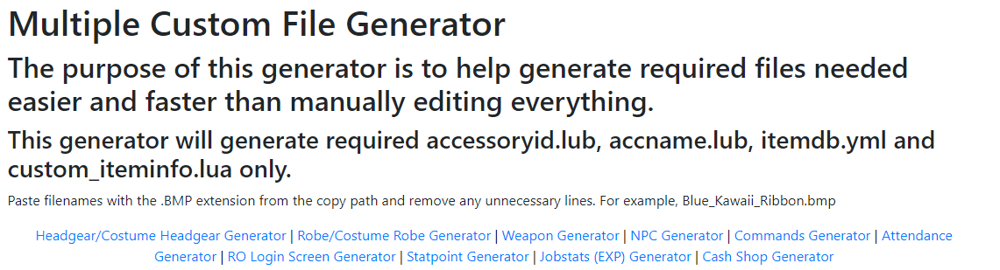

# Customization
In the drop-down list on the left you can find several guides.  

Disclaimer  
I don't take any credit for any of the copied guides.
___
## Basic Setup
This will only explain the client side, please visit the original topic, if there is one, for more information about the server-side of it.  

Before editing any kind of lua file in this project, I would recommend to check the [Text Editor Settings](https://llchrisll.github.io/ROTPDocs/contribution/#text-editor-settings).  
As I use Notepad++, I can only provide a "guide" for that.

**Note**  
You are free to use any kind of editor you want, just make sure that the encoding is correct.  

##### Resource Files  
Of course you need respective files for your custom items to work.  
The basic setup contains 3 files, which is used for every other item as well.  
But depending on the item type you want to add you require additional files to see the item correctly, which are descriped in the sections below.

* Drop & Drag Sprite  
   `data\sprite\¾ÆÀÌÅÛ`  
    Responsible to show a sprite if the item is being dropped or dragged, if you don't have one you mostly crash.
* Texture Files  
  `data\texture\À¯ÀúÀÎÅÍÆäÀ̽º`  
    `\item`: This file is reponsible to show an image of your item while it's equipped and in inventory.  
    `\collection`: Shows an image when your open the item description.

##### ItemInfo.lub  
Once your files are in place, it's time to open your itemInfo file.  
```
	[ID] = {
		unidentifiedDisplayName = "Unknown Item",
		unidentifiedResourceName = "",
		unidentifiedDescriptionName = { "" },
		identifiedDisplayName = "Item",
		identifiedResourceName = "",
		identifiedDescriptionName = {
			"Line 1",
			"Line 2"
		},
		slotCount = 0,
		ClassNum = 0,
		costume = false
	},
```
##### Explanation  
The only difference between the first six arguments is that it depends on if the item was Identified or not.

- DisplayName = Display Name
- ResourceName = File Name
- DescriptionName = Description
- slotCount = Defines the amount of visual card slots
- ClassNum = Defines the View ID for Headgears/Weapons/Costume Garments and Shields
- costume = true/false, defines if the item is a costume (showing in a different tab in the storage)
___
## Custom Files Generator  
[Chaos92](https://rathena.org/board/profile/6755-chaos92/), made a simple website to generate the file (lua, yml, etc) with entries for your custom items/npcs/etc based on the item you want to create.  
Currently it supports a few simple generators.  
  

Link to the guide can be found [here](https://rathena.org/board/topic/140207-multiple-custom-files-generator/),
here the actual [generator](https://x-files.amirazman.my/customfilegenerator/).

If you have issues, suggestions or anything else, feel free to contact him about it :).