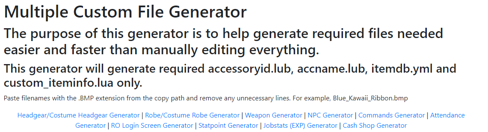

[Chaos92](https://rathena.org/board/profile/6755-chaos92/), made a simple website to generate the file (lua, yml, etc) with entries for your custom items/npcs/etc based on the item you want to create.  
Currently it supports a few simple generators.  
  

Link to the guide can be found [here](https://rathena.org/board/topic/140207-multiple-custom-files-generator/),
here the actual [generator](https://x-files.amirazman.my/customfilegenerator/).

If you have issues, suggestions or anything else, feel free to contact him about it :).