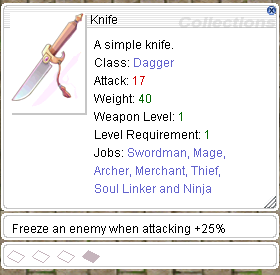

# Customization
I will only provide the client-side steps required to make it work,  
please visit the original topic, if there is one, for more information about the server-side it.

## Multi-Iteminfo Support
The best way in my opinion is to use a Multi-Item Info in addition to this translation project.
Cause you then have your custom items seperated from the translated files, which might overwrite your items on every update.

1. [sader1992](https://rathena.org/board/topic/118340-client-resource-customize-your-iteminfo-with-import/)
2. [NeoMind](https://rathena.org/board/topic/98148-guide-how-to-use-a-secondary-iteminfo-file/)
3. [Cydh](https://pservero.com/2015/02/07/multi-iteminfo-files/)

What I personally use is NeoMind's option, as this project is mixed version of every RO (kRO,jRO and iRO mostly).
I didn't test the other's yet, but they look awesome as well.
___
## Custom Items
There are 2 ways to add your custom items

1. Multi-Item Info Support (I will call it MII)  
2. System\itemInfo.lua (if you use this project itemInfo_EN.lua)

Both work in the same way, but in case of the MII your custom items are seperately loaded from the translationoriginal itemInfo file, which makes it easier to manage.

##### Resource Files  
Of course you need respective files for your custom items to work.  
The basic setup contains 3 files, which is used for every other item as well.  
But depending on the item type you want to add you require additional files to see the item correctly, which are descriped in the sections below.

* Drop & Drag Sprite  
   `data\sprite\¾ÆÀÌÅÛ`  
    Responsible to show a sprite if the item is being dropped or dragged, if you don't have one you mostly crash.
* Texture Files  
  `data\texture\À¯ÀúÀÎÅÍÆäÀ̽º`  
    `\item`: This file is reponsible to show an image of your item while it's equipped and in inventory.  
    `\collection`: Shows an image when your open the item description.

##### ItemInfo.lub  
Once your files are in place, it's time to open your itemInfo file.  
```
	[ID] = {
		unidentifiedDisplayName = Unknown Item,
		unidentifiedResourceName = ,
		unidentifiedDescriptionName = {  },
		identifiedDisplayName = Item,
		identifiedResourceName = ,
		identifiedDescriptionName = {
			Line 1,
			Line 2
		},
		slotCount = 0,
		ClassNum = 0,
		costume = false
	},
```
##### Explanation  
The only difference between the first three arguments is that it depends on if the item was Identified or not

- DisplayName = Display Name
- ResourceName = File Name
- DescriptionName = Description
- slotCount = Defines the visual aspect of card slots
- ClassNum = Defines the View ID for HeadgearsWeapons and Costume Garments
- costume = true/false, defines if the item is a costume (showing in differently in certain tabs)
___
## Headgears
Adding custom headgears requires 4 additional files and 2 more lua files to adjust.  
Headgear Sprite Files consist of `gender_name.act` and `gender_name.spr`, meaning 2 files per gender.  
##### Headgear Files  
There are 2 folders, which are for the gender.

*  `data\sprite\¾Ç¼¼»ç¸®\³²` (Male)
*  `data\sprite\¾Ç¼¼»ç¸®\¿©` (Female)
 
##### Lua Files
* `data\luafiles514\lua files\datainfo\accessoryid.lub`  
   View ID(Item DB)ClassNum(itemInfo.lub)  
* `data\luafiles514\lua files\datainfo\accname.lub`  
   File Name Entry, only consisting of `_name`, meaning the client will automatically add the gender at the front.

### Costume Headgears
Adding Costume Headgears is no different from regular heagears,  
you just change the `Location` node (YML) in the item database on your server and  
change the `costume = false` to `costume = true` in the `itemInfo.lub`, tho the lua part is optional.
___
## Weapons
Adding a custom Weapon can be done with it's own animation files or without.  

Custom Animation Files
  
   1. Open the `data\luafiles514\lua files\datainfo\weapontable.lub` (See explanation below)  
      Note Add your entries always after the last entry and to add a `,` after the previous one.
   2. `Weapon_IDs`  
      `WEAPONTYPE_CustomWeapon = 103`
   3. `WeaponNameTable`  
      `[Weapon_IDs.WEAPONTYPE_CustomWeapon] = _customweapon`
   4. `Expansion_Weapon_IDs`  
      `[Weapon_IDs.WEAPONTYPE_CustomWeapon] = Weapon_IDs.WEAPONTYPE_`  
       Assign a weapon type based on the `Weapon_IDs` table but only up to `WEAPONTYPE_SWORD_AXE = 30` are valid
   5. `BowTypeList`  
	  `Weapon_IDs.WEAPONTYPE_CustomWeapon`
       This is only used for bows obviously.  
   6. Sprite Files  
       `data\sprite\Àΰ£Á·` = Main Folder for Weapon Sprites  
        Each class has it's own folder and requires 2 files (.act.spr) of your custom weapon per gender.  
        While you can duplicate them and just rename it for a different class and gender, but the animations won't match the class' movement at all.  
        The file name depends on your `WeaponNameTable` entry above.  
        See [Folder List](https://github.com/llchrisll/ROResourceCollection/blob/master/spritelist.md) for info.

##### Explanation
- Weapon_IDs = Table for each weapon type  
  These values are used for the `ClassNum` argument in your `itemInfo.lub` entry, as well as your ViewID in your item db.
- WeaponNameTable = Table for the file name
- Expansion_Weapon_IDs = Table to assign the weapon to a weapon type
- WeaponHitWaveNameTable = Table which .wav file should be played for your custom weapon type
- BowTypeList = Table for Bows
___
## Garments (Robes)
[Original by  Froost](https://rathena.org/board/topic/128738-guide-robewings-installation-guide-2021/#comment-398328)

##### Files  
Note: I will use `Angel_Wing` as example.  
The Client requires for each class and per gender 2 files (.spr & .act),  
but since that might take a while to do and rename,  
you can use a generator like this, [Garment Generator](https://rathena.org/board/files/file/3585-saders-garment-files-generator/)  
and generate the required files for all classes (I haven’t tested it yet)

But let’s test only with 1 class to test:  
I’ll use `Novice` (Male), the sprite name for that is `Ãʺ¸ÀÚ_³²`  
##### Sprites
 
- robe (male) = `data\sprite\·Îºê\Angel_Wing\³²`
- robe (Female) = `data\sprite\·Îºê\Angel_Wing\¿©  `

Note: You can copy&paste the male sprites into the female folder and rename them like mentioned above.

Step 2 - Lua Files  
Afterwards we need to add some entries in the `spriterobename.lub` and `spriterobeid.lub`

##### SpriteRobeID
Add `ROBE_Angel_Wing = 84` at the end and a `,` after the last entry before yours.  

##### SpriteRobeName
1. Go to the end of the table `RobeNameTable` and `RobeNameTable_Eng`, add `[SPRITE_ROBE_IDs.ROBE_Angel_Wing ] = Angel_Wing` at the end and a `,` after the last entry before yours.
2. At the end of `RobeTopLayer` add `SPRITE_ROBE_IDs.ROBE_Angel_Wing` (remember the `,`)

##### TransparentItem  
If the Wing appears on the ALT+Q but does not appear on the character itself,  
you need to make an additional edit in the `transparentItem\transparentItem.lub`.  
It's an extra file that controls the transparency of the item,  
this file’s default for non-existent ids is 0 (transparent) so you just open it and add at the end  
`{ 84, 255, 255, 0 },`  
84 = is the ID

### Convert Custom Wings (Headgears) to Robes
[Original by madtoyz](https://rathena.org/board/topic/72734-guide-custom-wings-at-robe-place/#comment-148019)

Converting your custom Wings, which can be headgears is fairly simple  
Take the guide above in consideration, but instead of extra files for robes,  
you take the headgears files from `data\sprite\¾Ç¼¼»ç¸®\³²` and `data\sprite\¾Ç¼¼»ç¸®\¿©`  
as base and insert them the same way as above in the `·Îºê` folder.
___
## Hat Effect
[Original by khyle650](https://rathena.org/board/topic/132752-guide-add-new-hateffect-aura-style/#comment-412723)

Note I will use `c_hateffect` and `HAT_EF_c_hateffect` as example

1. Open `data\texture\effect` folder
2. Move your files in a seperate folder in there
3. Open `data\luafiles514\lua files\hateffectinfo\hateffectinfo.lub`
4. Go the last entry of the `HatEFID` table (Example `HAT_EF_SERPENT_SHADOW = 180`)
5. Add a `,` after it and add in the same way your hateffect with an sequential ID (=Don't skip ID's)
6. Go to the last entry of `hatEffectTable`
7. Use the following layout entry as base (remember to put an `,` after the last entry)  
```
    [HatEFID.HAT_EF_c_hateffect] = {  
        resourceFileName = c_hateffectc_hateffect.str,  
        hatEffectPos = -1,  
        hatEffectPosX = 0,  
        isRenderBeforeCharacter = false,  
        isIgnoreRiding = false,  
        isAdjustPositionWhenShrinkState = true,  
        isAdjustSizeWhenShrinkState = true  
    }, 
```
##### Explanation

- resourceFileName path to the datatextureeffect folder (effect nameeffect_name.str)  
- IsIgnoreRiding true makes the hateffect not to adjust to your mount  
- isRenderBeforeCharacter true makes the effect appear over the character  
- hatEffectPos Y Position (up and down) of the hateffect  
- hatEffectPosX X Position (left and right) of the hattect  
- isAdjustPositionWhenShrinkState put always true  
- isAdjustSizeWhenShrinkState put always true
___
## Custom NPC/Mob/Pet
 
##### Lua Files
 
- `data\luafiles514\lua files\datainfo\npcidentity.lub`  
	Holds the ID of the respective NPCMobPet
- `data\luafiles514\lua files\datainfo\jobname.lub`  
	Holds the resource file name of the respective NPCMobPet  
- `data\luafiles514\lua files\datainfo\jobidentity.lub`  
	Required for custom NPCs like `npcidentity.lub`, it holds the ID.  
- `data\luafiles514\lua files\datainfo\petinfo.lub`  
	Required for custom Pets, see below for a seperate explanation.  

##### Sprite Folders
 
- MobPet `data\sprite\¸ó½ºÅÍ`  
- NPC `data\sprite\npc`

##### PetInfo.lub
 
- PetNameTable  
	Contains the resource file name of the pet
- PetIllustNameTable  
	Contains the file name for the image in the Pet Info window  
- PetIllustNameTable_Eng  
    English equivalent of the above one  
- PetAccIDs  
    Contains the Item ID for Pet Accessories  
- PetAccActNameTable  
    Contains the .act file name for Pet Accessories  
- PetAccActNameTable_Eng  
    English equivalent of the above one  
- PetStringTable  
    Contains the Pet Name  
- PetEggItemID_PetJobID  
    Assigns the Egg Item ID to a Pet
- PetFoodTable  
    Assigns the Food Item ID to a Pet
___
## Disable Doram Race
[Original by Secret](https://rathena.org/board/topic/117041-tutorial-how-to-disable-creation-of-summoner-characters/#comment-351888)

Note Depending on the langtype and Ragexe type (Ragexe.exe or RagexeRE.exe), it will require you to edit different files.
Also it depends on if you have the NEMOWARP patch `Always load korea ExternalSettings lua file` available or not, if not see link to langtype.
But I will go by the default of `langtype 0` and `Ragexe.exe`

 1. Open the `data\luafiles514\lua files\service_korea\externalsettings_kr.lub`.
 2. Find and edit the following line `MakeableRace = { Doram = true }`
 3. Change it to `Doram = false`
 4. Save and close the file.
___
## Maps with Navigation/World Map Support 
[Original by Shinsei](https://rathena.org/board/topic/122544-guide-fresh-all-in-one-guide-to-implementing-maps-with-worldmap/#comment-372759)

1. `datamappostable.txt`  
At the top of the file you should see #@ (probably 12@), change that to 13@ (That is the array size of the mappostable)
Scroll down to the bottom of the file and add the the map you want to add (as well as its coordinates on the map where it should appear) in the following format  
`[index]#[mapname].rsw#x¹#y¹#x²#y²#`
	- x¹, y¹, x², y² stand for the start and end coordinates of the map box which gets drawn on the world map.  
    Navigate to `data\luafiles514\lua files\worldviewdata\`  
    Find files `worldviewdata_table.lub` as well as `worldviewdata_language.lub`  
	(if your files are inside a GRF, extract them).  
       - Open your `worldviewdata_language.lub` and add the following line  
	   `MSI_###_[MAPNAME] = Map Display Name,`  
	   (if you’re adding it at the end of the array, don’t forget to remove the comma, as it’s the last element of the array.
       - Now open your `worldviewdata_table.lub` and add the following line  
	   `{###, [mapname].rsw, x¹, y¹, x², y², WORLD_MSGID.MSI_###_[MAPNAME],}`

	**IMPORTANT**  
	The ### number at the start of this array appears to be corresponding to a general “block” location on the map.  
	e.g. If you’re adding a map somewhere in the Payon area, you would want this number to be “111”,  
	however if you’re adding it in the area of Rachel, you’d want the number to be “105”.  
	In short, whenever you’re adding maps, always take a look at the numbers of the maps close to your new map,  
	use those numbers.  
	If your map doesnt appear on the worldmap, this is more than often the culprit behind it!

2. Go to `data\luafiles514\lua files\datainfo\` (Optional)  
This is where you will be adding the kafra teleporting service animations.  
Open the file `kaframovemapservicelist.lub` and add Kafra teleport service information to your map as well as KafraMinimapPos  
I am not certain what the parameters in this array do, if anyone has any idea, please let me know.

##### Navigation
**IMPORTANT**  
Remember to make a backup of it before you start working on it.  

Open the navigation folder and add your custom map to the `navi_map_krpri.lub`.  
To do that, open up the file, scroll all the way down the list and add your map in the following format `{ [mapname], Display name, ID, xSize, ySize }`

If you don't have any files, you can use the `navigenerator.bat` included in the server folder which is generator if you buildcompile it via your `rAthena.sln` and automatically generate them based on the NPC's and Maps which are available for you.

**NOTE**  
The Display name is going to be name displayed over your map  
There are 3 values for the IDs  
(I am not 100% certain about what they are exactly, will need to research it more - then I will update the information here)
  
* 5001 is used for standard maps, such as Towns, Fields, Dungeons.  
* 5002 appears to be used for maps which have clone counterparts  
* 5003 is used for indoor maps

xSize and ySize correspond to the values of gat.Width as well as gat.Height

	Adding connections between neighbouring maps  
	To do that, you want to open `navi_link.lub` and add connections to; as well as from the neighbouring maps in the following format  
	`{ [yourmap] , [index], 200, 99999, [yourmapname]_[destmapname]_[index], , xCoord, yCoord, payo2, destCoord_x, destCoord_y},`  
	e.g.  
	`{ pay_arche, 14056, 200, 99999, pay_arche_payon_706, , 81, 17, payon,  228, 327 },`  
	`{ payon, 15327, 200, 99999, payon_pay_arche_1977, , 228, 329, pay_arche, 81, 22 },`

##### Duplicate/Clone Maps  
Duplicating/cloning maps is very easy with the `dataresnametable.txt`,  
which is takes original files and redirects the client to them instead files for  your custom map which don't exist.
This makes copy & paste of original files unnecessary. 

**Layout**

	Custom Mapname.gnd#Original Mapname.gnd#  
	Custom Mapname.gat#Original Mapname.gat#  
	Custom Mapname.rsw#Original Mapname.rsw#  
	À¯ÀúÀÎÅÍÆäÀ̽º\map\Custom Mapname.bmp#À¯ÀúÀÎÅÍÆäÀ̽º\map\Original Mapname.bmp#  

Remember to either use a Map Cache Editor or the `mapcache.bat` from rAthena.
___
## Skill Icons
[Original by iraciz](https://rathena.org/board/topic/97954-guide-adding-custom-icons-to-skills/#comment-268363)
***
First of all you need the data files, those are:

* Sprite and Act of your custom icon.
* Item Bmp of your custom Icon.

### Steps

1. Place your custom Icon Sprite and Act in `data/sprite/¾ÆÀÌÅÛ`  
	
	**IMPORTANT**  
	The icon need to be named exactly as the skill name displayed in the DB,  
	if you don't know it, you have 2 choices, open skill_db.txt or login into your server  
	and use the command @skillid "name" to confirm.  
	RO data.grf brought 3 party icons as default, but the name was changed and I had to rename it according to the Skill Name in the skill_db.yml

2. Place the Custom Icon BMP in `data/texture/À¯ÀúÀÎÅÍÆäÀ̽º/item`  
	**IMPORTANT**  
	As step #1, It need to be named exactly as the skill name, also need to be bmp size 24x24  
	Editing Lua Files  
	Some Skills do not exist in the lua files, and the must be added because files are conected and they take each other names as reference to read information, for example if you only add the sprites and bmp, it does'nt guarantee that your skill will show the icon, just because you added files with the name.

3. Go to `data\luafiles514\lua files\skillinfoz`

* skillid.lub  
  In this file you need to check if your current skill exist! if not, you need to add a new one according to the skill name, and skillid number.
* skilldescript.lub  
  In this file if your customized icon belong to a non-included skill in this file, you will have to add or include the new skill, because a name need to be taken as reference there.

	For Example: Party Skills are not included in the txt skilldescript.lub, in order to recognize the custom icon, the skill must be created or added into that file.  
	You can do the same for other skills such as Darkstrike, Dragon Fear, etc, respecting the lime formats of the luafiles " ",

* skillinfolist.lub  
  This file include a list of every skill registered, of course if you use an icon for a new skill, you need to add the skill in this file.  
  This file also display son information in the game skill window.

**Structure**  
This information do not affect the skill sctructure in game, but it is necessary  
because its used to display information when scrolling mouse over the skill icon,  
and casting ranged skills, if you cast a skill no included in this file,  
maybe the range will not be recognized and it will pop up a warning of cant get skill range. 

```
[sKID. "the exactly name of the skill must be added there, don't mess with that."] = {  
"ICON NAME";  
SkillName = "This is the tex that the character will display when casting the skill",  
MaxLv = the max level of the skill existing in the skilldb.txt.  
SpAmount = { sp consumed by level according to the skilldb structure, this will be showed in the player skill window}  
bSeperateLv = true for seperated skill leves such as warmwind, teleport, gospel etc, false to fix the skill to the last level applied,  
AttackRange = {Range of the skill according to the skill level range of skills in the skill_db.txt}  
```
___
## Random Options
[Original by Easycore](https://rathena.org/board/topic/110692-guide-adding-custom-random-options/)  
**Introduction**

In this guide I will introduce you how to implement custom Random Options.  
I will use as an example the bonus "bAddEff".



For display our custom options must be added to `data\luafiles514\lua files\datainfo\enumvar.lub` and `data\luafiles514\lua files\datainfo\addrandomoptionnametable.lub

#### enumvar.lub
Find:  
`VAR_CRITICAL_RATE = { 254, 10 },`  
And add:  
`WEAPON_FREEZE = {255, 0 },`  
*The first number must be same that added in `db\re\item_randomopt_db.yml*

#### addrandomoptionnametable.lub
Find:  
`[EnumVAR.MDAMAGE_SIZE_LARGE_USER[1]] = "Magical resistance Large size monster +%d%%",`  
And add:  
`[EnumVAR.WEAPON_FREEZE[1]] = "Freeze an enemy when attacking +%d%%",`  
*%d% is equal to ROA_VALUE.* 

After completing all of the above your Random Option is ready to use.  
Remember that there is documentation of how to add random options to items and a sample npc.
___
## Enchant System
[Original by khyle650](https://rathena.org/board/topic/132764-the-new-enchant-system-cannot-be-openedused-correctly/#comment-412806)  
You need add an entry in `data\luafiles514\lua files\ItemDBNameTbl.lub` of your item  
and enchant details in `data\luafiles514\lua files\Enchant\EnchantList.lub`

### ItemDBNameTbl.lub Example
```
	F_Ein_Weapon_Hammer = 102124,
	Diabolus_Armor = 2375,
	Diabolus_Boots = 2433,
	Diabolus_Helmet = 5808,
	Diabolus_Manteau = 2537,
	Diabolus_Ring = 2729,
	Diabolus_Robe = 2374
```
### EnchantList.lub Example
```
Table[68] = CreateEnchantInfo()
Table[68]:SetSlotOrder(3, 2, 1)
Table[68]:AddTargetItem("Diabolus_Armor")
Table[68]:AddTargetItem("Diabolus_Boots")
Table[68]:AddTargetItem("Diabolus_Helmet")
Table[68]:AddTargetItem("Diabolus_Manteau")
Table[68]:AddTargetItem("Diabolus_Ring")
Table[68]:AddTargetItem("Diabolus_Robe")
Table[68]:SetCondition(0, 0)
Table[68]:ApproveRandomOption(true)
Table[68]:SetReset(true, 100000, 3000000)
Table[68]:SetCaution("Diabolus Set Enchantment\nSuccess Chance: 100%\nReset Chance: 100%, will not be destroyed on failure")
Table[68].Slot[3]:SetRequire(100000)
Table[68].Slot[3]:SetSuccessRate(100000)
Table[68].Slot[3]:SetGradeBonus(1, 0)
Table[68].Slot[3]:SetGradeBonus(2, 0)
Table[68].Slot[3]:SetGradeBonus(3, 0)
Table[68].Slot[3]:SetGradeBonus(4, 0)
Table[68].Slot[3]:SetEnchant(0, "Èû1", 12460)
Table[68].Slot[3]:SetEnchant(0, "ÀÎÆ®1", 12470)
Table[68].Slot[3]:SetEnchant(0, "¾îÁú1", 12470)
Table[68].Slot[3]:SetEnchant(0, "¹ÙÅ»1", 12470)
Table[68].Slot[3]:SetEnchant(0, "·°1", 12460)
Table[68].Slot[3]:SetEnchant(0, "µ¦1", 12470)
Table[68].Slot[3]:SetEnchant(0, "Èû2", 3500)
Table[68].Slot[3]:SetEnchant(0, "ÀÎÆ®2", 3500)
Table[68].Slot[3]:SetEnchant(0, "¾îÁú2", 3500)
Table[68].Slot[3]:SetEnchant(0, "¹ÙÅ»2", 3500)
Table[68].Slot[3]:SetEnchant(0, "·°2", 3500)
Table[68].Slot[3]:SetEnchant(0, "µ¦2", 3500)
Table[68].Slot[3]:SetEnchant(0, "Èû3", 700)
Table[68].Slot[3]:SetEnchant(0, "ÀÎÆ®3", 700)
Table[68].Slot[3]:SetEnchant(0, "¾îÁú3", 700)
Table[68].Slot[3]:SetEnchant(0, "¹ÙÅ»3", 700)
Table[68].Slot[3]:SetEnchant(0, "·°3", 700)
Table[68].Slot[3]:SetEnchant(0, "µ¦3", 700)
Table[68].Slot[3]:AddPerfectEnchant("Èû1", 500000)
Table[68].Slot[3]:AddPerfectEnchant("ÀÎÆ®1", 500000)
Table[68].Slot[3]:AddPerfectEnchant("¾îÁú1", 500000)
Table[68].Slot[3]:AddPerfectEnchant("¹ÙÅ»1", 500000)
Table[68].Slot[3]:AddPerfectEnchant("·°1", 500000)
Table[68].Slot[3]:AddPerfectEnchant("µ¦1", 500000)
Table[68].Slot[3]:AddPerfectEnchant("Èû2", 1000000)
Table[68].Slot[3]:AddPerfectEnchant("ÀÎÆ®2", 1000000)
Table[68].Slot[3]:AddPerfectEnchant("¾îÁú2", 1000000)
Table[68].Slot[3]:AddPerfectEnchant("¹ÙÅ»2", 1000000)
Table[68].Slot[3]:AddPerfectEnchant("·°2", 1000000)
Table[68].Slot[3]:AddPerfectEnchant("µ¦2", 1000000)
Table[68].Slot[3]:AddPerfectEnchant("Èû3", 3000000)
Table[68].Slot[3]:AddPerfectEnchant("ÀÎÆ®3", 3000000)
Table[68].Slot[3]:AddPerfectEnchant("¾îÁú3", 3000000)
Table[68].Slot[3]:AddPerfectEnchant("¹ÙÅ»3", 3000000)
Table[68].Slot[3]:AddPerfectEnchant("·°3", 3000000)
Table[68].Slot[3]:AddPerfectEnchant("µ¦3", 3000000)
Table[68].Slot[3]:AddUpgradeEnchant("Èû1", "Èû2", 500000)
Table[68].Slot[3]:AddUpgradeEnchant("Èû2", "Èû3", 1000000)
Table[68].Slot[3]:AddUpgradeEnchant("ÀÎÆ®1", "ÀÎÆ®2", 500000)
Table[68].Slot[3]:AddUpgradeEnchant("ÀÎÆ®2", "ÀÎÆ®3", 1000000)
Table[68].Slot[3]:AddUpgradeEnchant("¾îÁú1", "¾îÁú2", 500000)
Table[68].Slot[3]:AddUpgradeEnchant("¾îÁú2", "¾îÁú3", 1000000)
Table[68].Slot[3]:AddUpgradeEnchant("¹ÙÅ»1", "¹ÙÅ»2", 500000)
Table[68].Slot[3]:AddUpgradeEnchant("¹ÙÅ»2", "¹ÙÅ»3", 1000000)
Table[68].Slot[3]:AddUpgradeEnchant("·°1", "·°2", 500000)
Table[68].Slot[3]:AddUpgradeEnchant("·°2", "·°3", 1000000)
Table[68].Slot[3]:AddUpgradeEnchant("µ¦1", "µ¦2", 500000)
Table[68].Slot[3]:AddUpgradeEnchant("µ¦2", "µ¦3", 1000000)
Table[68].Slot[2]:SetRequire(200000)
Table[68].Slot[2]:SetSuccessRate(100000)
Table[68].Slot[2]:SetGradeBonus(1, 0)
Table[68].Slot[2]:SetGradeBonus(2, 0)
Table[68].Slot[2]:SetGradeBonus(3, 0)
Table[68].Slot[2]:SetGradeBonus(4, 0)
Table[68].Slot[2]:SetEnchant(0, "Èû1", 12460)
Table[68].Slot[2]:SetEnchant(0, "ÀÎÆ®1", 12470)
Table[68].Slot[2]:SetEnchant(0, "¾îÁú1", 12470)
Table[68].Slot[2]:SetEnchant(0, "¹ÙÅ»1", 12470)
Table[68].Slot[2]:SetEnchant(0, "·°1", 12460)
Table[68].Slot[2]:SetEnchant(0, "µ¦1", 12470)
Table[68].Slot[2]:SetEnchant(0, "Èû2", 3500)
Table[68].Slot[2]:SetEnchant(0, "ÀÎÆ®2", 3500)
Table[68].Slot[2]:SetEnchant(0, "¾îÁú2", 3500)
Table[68].Slot[2]:SetEnchant(0, "¹ÙÅ»2", 3500)
Table[68].Slot[2]:SetEnchant(0, "·°2", 3500)
Table[68].Slot[2]:SetEnchant(0, "µ¦2", 3500)
Table[68].Slot[2]:SetEnchant(0, "Èû3", 700)
Table[68].Slot[2]:SetEnchant(0, "ÀÎÆ®3", 700)
Table[68].Slot[2]:SetEnchant(0, "¾îÁú3", 700)
Table[68].Slot[2]:SetEnchant(0, "¹ÙÅ»3", 700)
Table[68].Slot[2]:SetEnchant(0, "·°3", 700)
Table[68].Slot[2]:SetEnchant(0, "µ¦3", 700)
Table[68].Slot[2]:AddPerfectEnchant("Èû1", 500000)
Table[68].Slot[2]:AddPerfectEnchant("ÀÎÆ®1", 500000)
Table[68].Slot[2]:AddPerfectEnchant("¾îÁú1", 500000)
Table[68].Slot[2]:AddPerfectEnchant("¹ÙÅ»1", 500000)
Table[68].Slot[2]:AddPerfectEnchant("·°1", 500000)
Table[68].Slot[2]:AddPerfectEnchant("µ¦1", 500000)
Table[68].Slot[2]:AddPerfectEnchant("Èû2", 1000000)
Table[68].Slot[2]:AddPerfectEnchant("ÀÎÆ®2", 1000000)
Table[68].Slot[2]:AddPerfectEnchant("¾îÁú2", 1000000)
Table[68].Slot[2]:AddPerfectEnchant("¹ÙÅ»2", 1000000)
Table[68].Slot[2]:AddPerfectEnchant("·°2", 1000000)
Table[68].Slot[2]:AddPerfectEnchant("µ¦2", 1000000)
Table[68].Slot[2]:AddPerfectEnchant("Èû3", 3000000)
Table[68].Slot[2]:AddPerfectEnchant("ÀÎÆ®3", 3000000)
Table[68].Slot[2]:AddPerfectEnchant("¾îÁú3", 3000000)
Table[68].Slot[2]:AddPerfectEnchant("¹ÙÅ»3", 3000000)
Table[68].Slot[2]:AddPerfectEnchant("·°3", 3000000)
Table[68].Slot[2]:AddPerfectEnchant("µ¦3", 3000000)
Table[68].Slot[2]:AddUpgradeEnchant("Èû1", "Èû2", 500000)
Table[68].Slot[2]:AddUpgradeEnchant("Èû2", "Èû3", 1000000)
Table[68].Slot[2]:AddUpgradeEnchant("ÀÎÆ®1", "ÀÎÆ®2", 500000)
Table[68].Slot[2]:AddUpgradeEnchant("ÀÎÆ®2", "ÀÎÆ®3", 1000000)
Table[68].Slot[2]:AddUpgradeEnchant("¾îÁú1", "¾îÁú2", 500000)
Table[68].Slot[2]:AddUpgradeEnchant("¾îÁú2", "¾îÁú3", 1000000)
Table[68].Slot[2]:AddUpgradeEnchant("¹ÙÅ»1", "¹ÙÅ»2", 500000)
Table[68].Slot[2]:AddUpgradeEnchant("¹ÙÅ»2", "¹ÙÅ»3", 1000000)
Table[68].Slot[2]:AddUpgradeEnchant("·°1", "·°2", 500000)
Table[68].Slot[2]:AddUpgradeEnchant("·°2", "·°3", 1000000)
Table[68].Slot[2]:AddUpgradeEnchant("µ¦1", "µ¦2", 500000)
Table[68].Slot[2]:AddUpgradeEnchant("µ¦2", "µ¦3", 1000000)
Table[68].Slot[1]:SetRequire(300000)
Table[68].Slot[1]:SetSuccessRate(100000)
Table[68].Slot[1]:SetGradeBonus(1, 0)
Table[68].Slot[1]:SetGradeBonus(2, 0)
Table[68].Slot[1]:SetGradeBonus(3, 0)
Table[68].Slot[1]:SetGradeBonus(4, 0)
Table[68].Slot[1]:SetEnchant(0, "Èû1", 12460)
Table[68].Slot[1]:SetEnchant(0, "ÀÎÆ®1", 12470)
Table[68].Slot[1]:SetEnchant(0, "¾îÁú1", 12470)
Table[68].Slot[1]:SetEnchant(0, "¹ÙÅ»1", 12470)
Table[68].Slot[1]:SetEnchant(0, "·°1", 12460)
Table[68].Slot[1]:SetEnchant(0, "µ¦1", 12470)
Table[68].Slot[1]:SetEnchant(0, "Èû2", 3500)
Table[68].Slot[1]:SetEnchant(0, "ÀÎÆ®2", 3500)
Table[68].Slot[1]:SetEnchant(0, "¾îÁú2", 3500)
Table[68].Slot[1]:SetEnchant(0, "¹ÙÅ»2", 3500)
Table[68].Slot[1]:SetEnchant(0, "·°2", 3500)
Table[68].Slot[1]:SetEnchant(0, "µ¦2", 3500)
Table[68].Slot[1]:SetEnchant(0, "Èû3", 700)
Table[68].Slot[1]:SetEnchant(0, "ÀÎÆ®3", 700)
Table[68].Slot[1]:SetEnchant(0, "¾îÁú3", 700)
Table[68].Slot[1]:SetEnchant(0, "¹ÙÅ»3", 700)
Table[68].Slot[1]:SetEnchant(0, "·°3", 700)
Table[68].Slot[1]:SetEnchant(0, "µ¦3", 700)
Table[68].Slot[1]:AddPerfectEnchant("Èû1", 500000)
Table[68].Slot[1]:AddPerfectEnchant("ÀÎÆ®1", 500000)
Table[68].Slot[1]:AddPerfectEnchant("¾îÁú1", 500000)
Table[68].Slot[1]:AddPerfectEnchant("¹ÙÅ»1", 500000)
Table[68].Slot[1]:AddPerfectEnchant("·°1", 500000)
Table[68].Slot[1]:AddPerfectEnchant("µ¦1", 500000)
Table[68].Slot[1]:AddPerfectEnchant("Èû2", 1000000)
Table[68].Slot[1]:AddPerfectEnchant("ÀÎÆ®2", 1000000)
Table[68].Slot[1]:AddPerfectEnchant("¾îÁú2", 1000000)
Table[68].Slot[1]:AddPerfectEnchant("¹ÙÅ»2", 1000000)
Table[68].Slot[1]:AddPerfectEnchant("·°2", 1000000)
Table[68].Slot[1]:AddPerfectEnchant("µ¦2", 1000000)
Table[68].Slot[1]:AddPerfectEnchant("Èû3", 3000000)
Table[68].Slot[1]:AddPerfectEnchant("ÀÎÆ®3", 3000000)
Table[68].Slot[1]:AddPerfectEnchant("¾îÁú3", 3000000)
Table[68].Slot[1]:AddPerfectEnchant("¹ÙÅ»3", 3000000)
Table[68].Slot[1]:AddPerfectEnchant("·°3", 3000000)
Table[68].Slot[1]:AddPerfectEnchant("µ¦3", 3000000)
Table[68].Slot[1]:AddUpgradeEnchant("Èû1", "Èû2", 500000)
Table[68].Slot[1]:AddUpgradeEnchant("Èû2", "Èû3", 1000000)
Table[68].Slot[1]:AddUpgradeEnchant("ÀÎÆ®1", "ÀÎÆ®2", 500000)
Table[68].Slot[1]:AddUpgradeEnchant("ÀÎÆ®2", "ÀÎÆ®3", 1000000)
Table[68].Slot[1]:AddUpgradeEnchant("¾îÁú1", "¾îÁú2", 500000)
Table[68].Slot[1]:AddUpgradeEnchant("¾îÁú2", "¾îÁú3", 1000000)
Table[68].Slot[1]:AddUpgradeEnchant("¹ÙÅ»1", "¹ÙÅ»2", 500000)
Table[68].Slot[1]:AddUpgradeEnchant("¹ÙÅ»2", "¹ÙÅ»3", 1000000)
Table[68].Slot[1]:AddUpgradeEnchant("·°1", "·°2", 500000)
Table[68].Slot[1]:AddUpgradeEnchant("·°2", "·°3", 1000000)
Table[68].Slot[1]:AddUpgradeEnchant("µ¦1", "µ¦2", 500000)
Table[68].Slot[1]:AddUpgradeEnchant("µ¦2", "µ¦3", 1000000)
```
Note by llchrisll:  
Maybe I will dive into it some time how the EnchantList.lub is structured.
___
Disclaimer  
I don't take any credit for any of the copied guides.