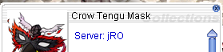

With the pull request [PR #67](https://github.com/llchrisll/ROenglishRE/pull/67), I have implemented [NeoMind](https://rathena.org/board/topic/98148-guide-how-to-use-a-secondary-iteminfo-file/)'s Multi-Iteminfo Support  
into the project, which also changed the iteminfo location and definition.  

#### System\itemInfo_EN.lua  
This file contains now the table for your custom entries,   
as well as the possbility to override offical items, like in Neo's original version.  
  
Below I will try to explain the configs which are possible:  
```
-- Load the splited function file
require("System/LuaFiles514/itemInfo_f")

-- Load the translation file
dofile("System/LuaFiles514/itemInfo.lua")

-- Load the additional files
-- Example: (Yes you could add kRO itemInfo itself, but prepare for lua errors)
--dofile("System/itemInfo_true.lub")

-- Additional Configs
-- Display origin server based on translation file's Server argument
-- 0 = disable/1 = in Item Name/2 = top of description/3 = bottom of description
DisplayOrigin = 1
-- Defines how the item id will be shown in item name, doesn't take effect in other settings
TagStart = '['
TagEnd = ']'

-- Show ItemID at bottom
-- 0 = disable/1 = top of description/2 = bottom of description
DisplayItemID = 2

-- Display a database link at bottom of description (true/false)
-- The item id will be automically parsed at the end of 'DbUrl/CustomDbUrl',
-- example: 'https://www.divine-pride.net/database/item/512'
DisplayDatabase = true
DbURL = 'https://www.divine-pride.net/database/item/'
DbDisplay = 'Divine-Pride.net'
-- Database link for custom items, like fluxcp
-- example: 'http://127.0.0.1/?module=item&action=view&id=512'
CustomDbUrl = 'http://127.0.0.1/?module=item&action=view&id='
CustomDbDisplay = 'Database'

-- Server Name for your custom items
ServerName = 'ExampleRO'

-- Define the colour in which the Server Name should be shown (affects official, if enabled, and custom items)
-- Format: '^<RRGGBB>'
-- '' = same color as "Server: " (blue)
-- '^FFFFFF' = white
ServerColour = ''
```

* `require` is most important and loads the function, which were split from the original iteminfo.  
This allows me to only have one global itemInfo.lua with all arguments,  
which are normally read by newer clients only, like `EffectID` and `costume`.  
* `dofile` loads files additionally to the `itemInfo_EN.lua`.  
Yes, it is possible to add multiple iteminfos, like what I do:  
```
-- Load the additional files
-- Example: (Yes you could add kRO itemInfo itself, but prepare for lua errors)
--dofile("System/itemInfo_true.lub")
dofile("System/item_kro.lua")
dofile("System/item_jro.lua")
dofile("System/item_iro.lua")
dofile("System/item_bro.lua")
dofile("System/item_idro.lua")
dofile("System/item_ghhro.lua")
dofile("System/item_twro.lua")
```
  
But to actually merge them into the main `tbl` via the `itemInfoMerge` function, you still need add a few lines which is explained at the end.  
**Note**  
These files contain missing and untranslated items from each server and are able to download from my discord in the [contribution](https://discord.com/channels/632937952997277696/721722941464903741/1159571115790827641) channel.


* `DisplayOrigin` reads the custom `Server` argument and displays it based on the value you put it on, like this:  
  
* `TagStart` and `TagEnd` defines how the server name is seperated from the Item Name and can be anything (tested with [] and () )  
   
* `DisplayItemID` displays the Item ID based on the value you put, like this:  
  
* `DisplayDatabase` displays an URL (opens in your webbrowser) to a database based on the value you put, which can define via `DbURL` and `DbDisplay`, like this:  
  
The same works for custom items via `CustomDbUrl` and only works if `DisplayDatabase` is enabled(true).  
  
* `ServerName` holds the name of your Server, which will be display for your custom items if `DisplayOrigin` is enabled.  
* `ServerColour` defines in which color your name will be highlighted.  
Example:  
`ServerColour = '^FF0000'`  
  
---
```
-- Table for Custom Items
tbl_custom = {
	--[[ Template
	[ID] = {
		unidentifiedDisplayName = "Unknown Item",
		unidentifiedResourceName = "",
		unidentifiedDescriptionName = { "" },
		identifiedDisplayName = "Item",
		identifiedResourceName = "",
		identifiedDescriptionName = {
			"Line 1",
			"Line 2"
		},
		slotCount = 0,
		ClassNum = 0,
		costume = false
	},
	]]
}

-- Table for Official Overrides
tbl_override = {
	--[[ Template
	[ID] = {
		unidentifiedDisplayName = "Unknown Item",
		unidentifiedResourceName = "",
		unidentifiedDescriptionName = { "" },
		identifiedDisplayName = "Item",
		identifiedResourceName = "",
		identifiedDescriptionName = {
			"Line 1",
			"Line 2"
		},
		slotCount = 0,
		ClassNum = 0,
		costume = false
	},
	]]
}
```

* `tbl_custom` holds the entries for your custom items.  
* `tbl_override` holds items you want to change,  
   overriding the official ones without touching the translation file directly.
---
```
function itemInfoMerge(src, state)
	if src == nil then
		return
	end
	for ItemID,DESC in pairs(src) do
		if state == false then
			if not tbl[ItemID] then
				tbl[ItemID] = {}
				tbl[ItemID] = DESC
			end
		else
			tbl[ItemID] = DESC
		end
		if src == tbl_custom then
			if ServerName ~= nil and tbl[ItemID].Server == nil then
				tbl[ItemID].Server = ServerName
			end
			if DisplayDatabase == true then
				tbl[ItemID].CustomDB = true
			end
		end
	end
	return
end

-- itemInfoMerge(src, state)
-- @src = table for merge into tbl
-- @state = overwrite existing entries (true) or not (false)

itemInfoMerge(tbl_override, true) -- official overrides
itemInfoMerge(tbl_custom, false) -- custom items
--itemInfoMerge(tbl, false) -- original kRO iteminfo
```
**DON'T TOUCH** the function `itemInfoMerge` unless you know what you are doing.  
I don't take responsiblity, if you change it without my knowledge.  

Like stated above, you also need to add a new function call with the new table, but be sure that it holds a different name than any present ones.  
See the commented one as example, which would merge the original kRO iteminfo into the global `tbl`.

My lines mentioned above:  
```
-- itemInfoMerge(src, state)
-- @src = table for merge into tbl
-- @state = overwrite existing entries (true) or not (false)

itemInfoMerge(tbl_override, true) -- official overrides
itemInfoMerge(tbl_custom, false) -- custom items
--itemInfoMerge(tbl, false) -- original kro iteminfo

itemInfoMerge(tbl_kro, false) -- kro
itemInfoMerge(tbl_jro, false) -- jro
itemInfoMerge(tbl_iro, false) -- iro
itemInfoMerge(tbl_idro, false) -- idro
itemInfoMerge(tbl_bro, false) -- bro
itemInfoMerge(tbl_ghhro, false) -- ghhro
itemInfoMerge(tbl_twro, false) -- twro
```
#### System\LuaFile514\itemInfo.lua  
This is now the itemInfo for translated items, just like the itemInfo_EN.lua before.  
The only difference is that it now contains every argument (costume and EffectID).  
	
#### System\LuaFiles514\itemInfo_f.lua  
This contains the function lines for the itemInfo and will now be the key to overwrite  
depending on the client you are using.