This page contains information about the `System\Rune\` folder and all it's files, which I collected myself.  

**Note: There might be mistakes and misunderstandings in there, if you have more information about it, let me know.**
___

The following list has the official name declared first, then the project's version.  

## Texture Folder
All textures are located in the `data\texture\À¯ÀúÀÎÅÍÆäÀ̽º\runesystem\` folder.  
Each file is declared/called via the files explained below.  

Subfolders are:

 * `runeset` : Holds the center images for the Rune Tablets  
 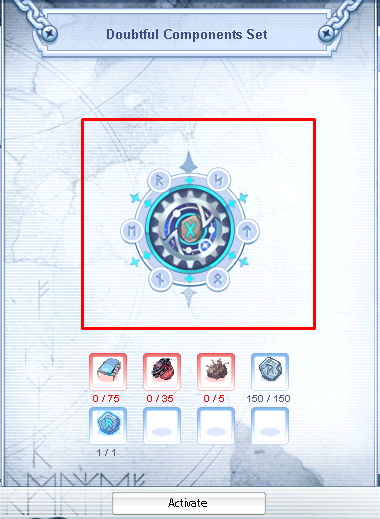 
 * `rune` : Holds the center images for the Runes  
 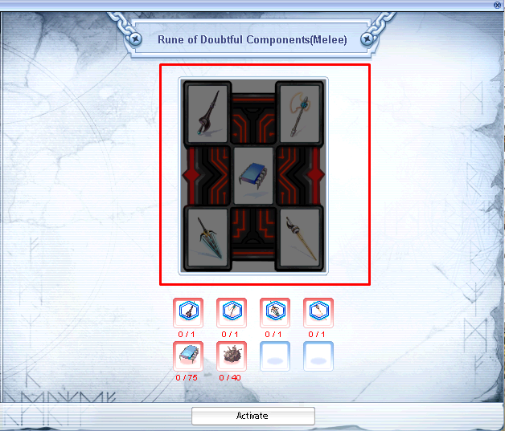 
 * `rune_icon` : Holds the small images for the Runes  
 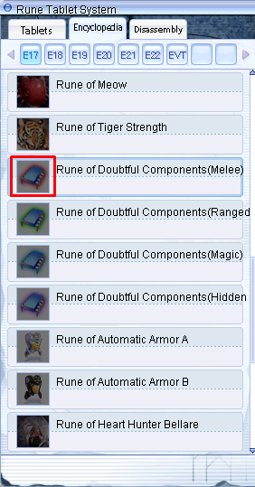 
 * `tag` : Holds the images for the Tags  
 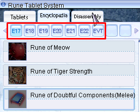 

## System/Rune | SystemEN/Rune 
This is the main folder all related files are located.  
The project uses, like other `System` folder related files, the `SystemEN` folder.  
Also slightly different names compared to the official ones.  

**_Note_**: For the sake of showing examples, I will use one official entry:

	Rune: Rp_Ep17_Melee - Doubtful Components(Melee)
	Rune Tablet: Rt_Ep17_Doubt - Doubtful Components  

### runesystemid.lub | systemid.lub
This file is one of most important ones as it holds all entries required for the whole system to work.  
It defines the Runes as well as the Rune Tablets (Set Effects) with a unique ID, which needs to match the server side, similiar to an Item ID.  

There are three tables present:  

 * `RUNESETIDTBL` : Holds the unique IDs for each Rune Tablet (Set), they start with 1260000
	Key values (like `Rt_Ep17_Doubt`), have a prefix of `Rt` which is not required,
	makes it easier to identify later on, based on my assumption it is short for `Rune Tablet`.
 * `RUNEIDTBL` : Holds the unique IDs for each single Rune, they start with 1263000
	Key values (like `Rp_Ep17_Melee`) have a prefix of `Rp` which is not required,
	makes it easier to identify later on, based on my assumption it is short for `Rune Page`.
 * `RUNETAGIDTBL` : Tags can be seen as categories  
    It also defines the texture file name:  
	* `tag\bt_tag_<Tag>_0.bmp`
	* `tag\bt_tag_<Tag>_1.bmp`
	* `tag\bt_tag_<Tag>_equip.bmp`
 
#### Example
```lua
RUNESETIDTBL = {
	Rt_Ep17_Doubt = 1260000,
	
RUNEIDTBL = {
	Rp_Ep17_Melee = 1263000,
```

### runeSystem_table.lub | System_table.lub
Contains Activation and Upgrade requirements which are defined via an index value,  
they linked to `info.lub` (`Rune_ActiveList`) and `set_info.lub` (`RuneSetActiveList`/`RuneSet_UpGradeList`).

This file format is simple, based on the available "visual" slots, you can have up to 8 items.

```lua
	[<Index>] = {
		{<ItemID>,<Amount>}
	}
```

#### Examples
```lua
	[14] = {
		{1001364, 1},
		{1001365, 1},
		{1001366, 1},
		{1001367, 1},
		{25669, 75},
		{25668, 40}
	},
```
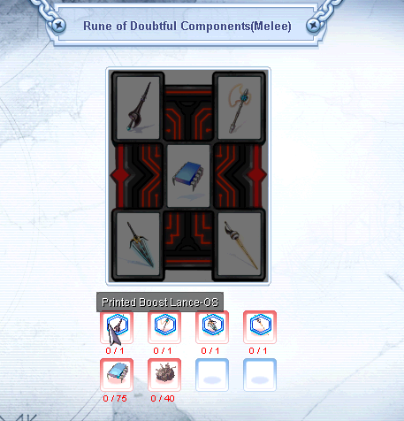  
```lua
	[1] = {
		{25669, 75},
		{25723, 35},
		{25668, 5},
		{1001282, 150},
		{1001283, 1}
	},
```
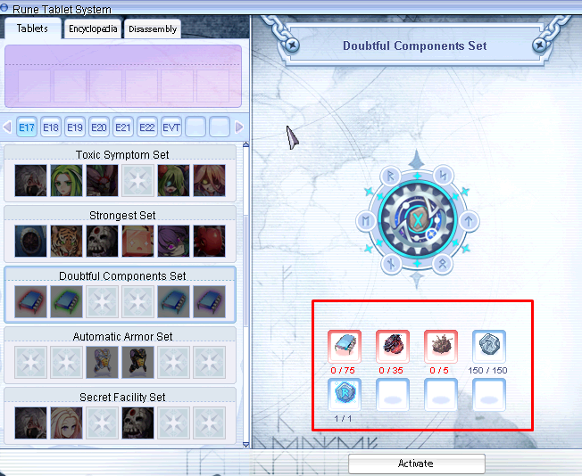  

### rune_info.lub | info.lub
This file holds the item list requirements to activate Runes.

 * `Rune_Res` : Defines the Texture file name
 * `Rune_ActiveList` : Refers to the requirement table (`RuneTable_itemList`) in  `System_table.lub` to activate it
 
##### Example
```lua
Runetbl_info = {
	[RUNETAGIDTBL.EPISODE17] = {
		[RUNEIDTBL.Rp_Ep17_Melee] = {Rune_Res = "Rp_Ep17_Melee", Rune_ActiveList = 14},
```

### rune_desc.lub | desc.lub
Simple file to define the display name of Runes themself.

##### Example
```lua
	[RUNETAGIDTBL.EPISODE17] = {
		[RUNEIDTBL.Rp_Ep17_Melee] = {Rune_DisplayName = "Doubtful Components(Melee)"},
```
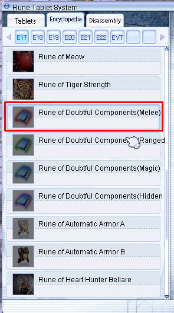

### runeset_info.lub | set_info.lub

 * `GradeTable` : Table for upgrade success
 * `GradeTable_Fail` : Table for increase of success chance if upgrade fails  

	All values are called via `RuneSet_UpGrade_Percentage_table` and `RuneSet_UpGrade_Percentage_table_Fail` respectively,  
	value being the index of the table.  
	Format: `[<Index>] = {<Chance_1>,...,<Chance_15>}
	`<Chance>` : Value * 1000 (8% > 8 * 1000 = 8000)
	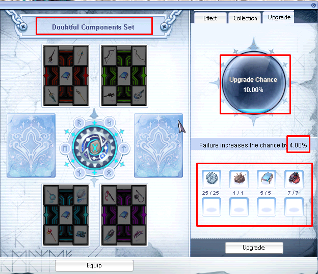
	<video controls><source src="../../images/runesystem/set_upgrade_clip.mp4" type="video/mp4"></video>
	
```lua
GradeTable = {
	[1] = {10000, 10000, 10000, 9000, 9000, 8000, 7000, 6000, 5000, 4000, 3000, 2000, 1000, 500, 100},

GradeTable_Fail = {
	[1] = {4000, 4000, 4000, 3600, 3600, 3200, 2800, 2400, 2000, 1600, 1200, 800, 400, 200, 40},
```
	
 * `RuneSetRes` : Texture file name
 * `RuneSetActiveList` : Value refers to item requirements to activate it, located in `System_table.lub`
 * `RuneSet_SlotList` : Values refers to `RUNEIDTBL` table and can have less values than 6, but that screws the slots
 * `RuneSet_UpGradeList` : Value refers to item requirements to upgrade (refine) it, located in `System_table.lub`
 * `RuneSet_UpGrade_Percentage_table` and `RuneSet_UpGrade_Percentage_table_Fail` :
   Both values refer to table index of `GradeTable` and `GradeTable_Fail` respectively,
   representing the success chance and the increase of the success chance in case the upgrade fails.
   
#### Example
```lua
	[RUNETAGIDTBL.EPISODE17] = {
		[RUNESETIDTBL.Rt_Ep17_Doubt] = {
			RuneSetRes = "Rt_Ep17_Doubt",
			RuneSetActiveList = 1,
			RuneSet_SlotList = {RUNEIDTBL.Rp_Ep17_Melee, RUNEIDTBL.Rp_Ep17_Range, 0, 0, RUNEIDTBL.Rp_Ep17_Magic, RUNEIDTBL.Rp_Ep17_Razor},
			RuneSet_UpGradeList = {45, 46, 47, 48, 49, 50, 51, 52, 53, 54, 55, 56, 57, 58, 59},
			RuneSet_UpGrade_Percentage_table = 1,
			RuneSet_UpGrade_Percentage_table_Fail = 1
		},
```
##### Locked Rune Tablet
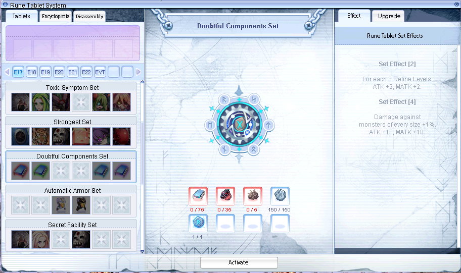

##### Unlocked Rune Tablet  
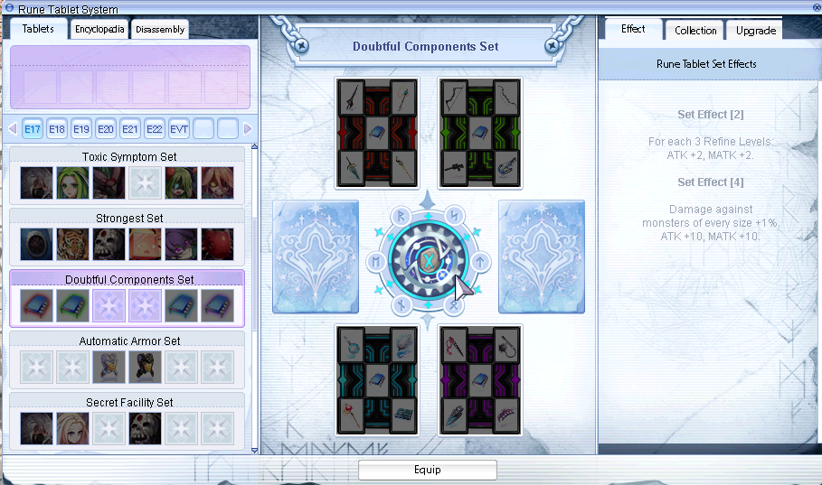

### runeset_desc.lub | set_desc.lub

 * `Runesystemtbl_tag` table : Declares a tooltip when you move your mouse over the Tags.

 * `RuneSettbl_desc` : Contains the description of set effects and the name of the Set
   * `RuneSetDisplayName` : Display Name for Set
   * `RuneSetDescription` : Will be split into set effects based on index value  
    `[2]` = 2 set effects, each `"",` will be printed in a new line

#### Examples
```lua
Runesystemtbl_tag = {
	[RUNETAGIDTBL.EPISODE17] = "EP17",
}
```
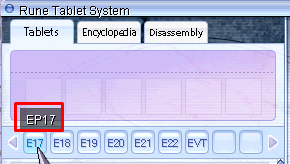
```lua
	[RUNETAGIDTBL.EPISODE17] = {
		[RUNESETIDTBL.Rt_Ep17_Doubt] = {
			RuneSetDisplayName = "Doubtful Components",
			RuneSetDescription = {
				[2] = {"For each 3 Refine Levels:", "ATK +2, MATK +2."},
				[4] = {"Damage against", "monsters of every size +1%.", "ATK +10, MATK +10."}
			}
		},
```
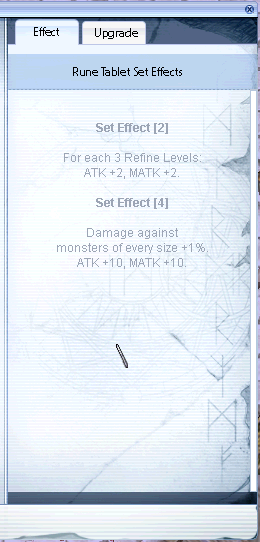

### runeset_reward.lub | set_reward.lub
The Rune Reward UI was implemented with 2024-10-16, adds new texture files as well as this file.  
Up to 7 rewards can be received based on existing entries, I didn't test what happens if you have less values.  

File format is simple and uses Item IDs.  
`{ <Reward_1>, <Reward_2>, <Reward_3>, <Reward_4>, <Reward_5>, <Reward_6>, <Completion_Reward> }`

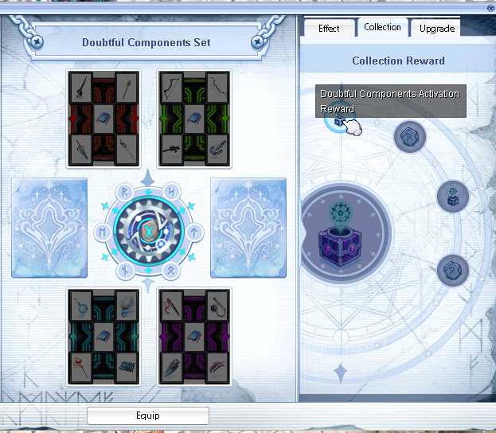
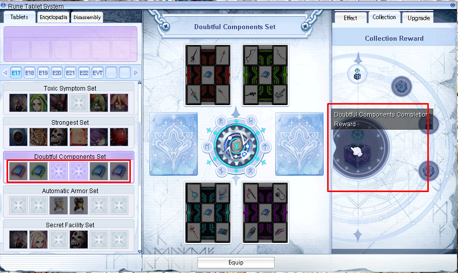

#### Example
```lua
	[RUNETAGIDTBL.EPISODE17] = {
		[RUNESETIDTBL.Rt_Ep17_Doubt] = {103335, 1001282, 103339, 1001282, 0, 0, 103340},
```

### itemDecom.lub | itemDecom.lub
This file controls the `Disassembly` part has 3 tables.  
For this I will take a Step Card (ID: 4698) as example.  

 * `itemDecomItemNum_tbl` : Disassemble Amount to select from; 2 values
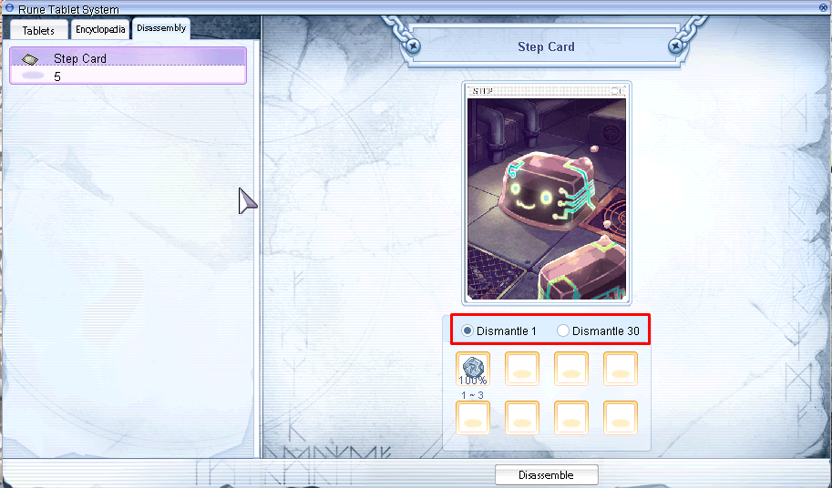

 * `itemDecomType_tbl` : Defines the list of disassembled materials per `<Type>`
	* `[<Type>] = {` :  
	Disassembled materials per entry (more entries means more possible materials)  
	Format: `{ <Item ID>, <Min Amount>, <Max Amount>, <Chance> }`
	
	* `<Item ID>` : ID of the material
	* `<Min Amount>/<Max Amount>` : Random value between these two values
	* `<Chance>` : 100% = 100000, 25% = 25000 (so % * 1000; 10% = 10000)
	
 * `itemDecom_tbl` : Simple list of items which can be disassembled  
	Format: `[<Item ID>] = {<Type1>,<Type2>}`
	
	* `<Item ID>` : ID which can be disassembled
	* `<Type1>` : would be selected if you dismantle "1"
	* `<Type2>` : would be selected if you dismantle "30"
	   
#### Examples
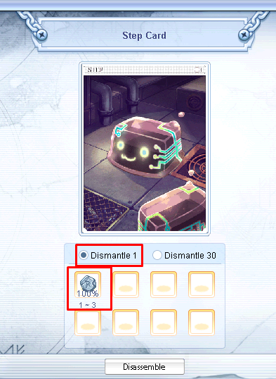
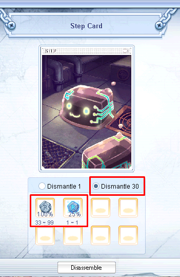
```lua
itemDecomItemNum_tbl = { 1, 30 }

itemDecomType_tbl = {
	[1] = {
		{1001282, 1, 3, 100000}
	},
	[2] = {
		{1001282, 33, 99, 100000}, <--- This, since <Type1> was selected
		{1001283, 1, 1, 25000}
	},
}

itemDecom_tbl = {
	[4698] = {1, 2},
}
```

### runesysteminfo.lub | systeminfo.lub
Even I'm not sure why this file exists.  
It just calls the function `GetDefultTag` to define a default tag...  
Same as the `dofile` line, the client reads it anyway.

```lua
dofile("systemen\\rune\\systemid.lub")
function GetDefultTag()
  return RUNETAGIDTBL.CHAPTER01
end
```