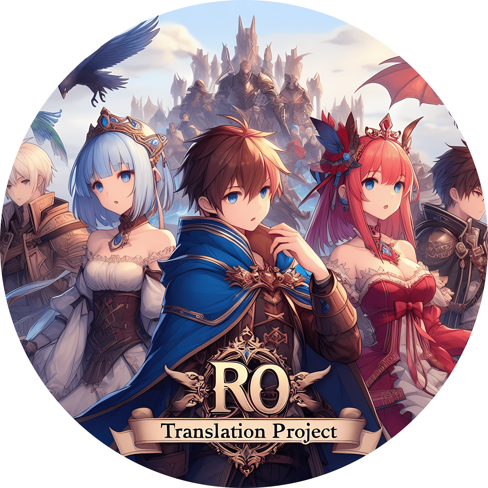

# Ragnarok Online Translation Project 
Welcome to the documentation for the Translation Project.  
Here you can find many useful guides for the client-side.  

Especially important is the guide to use this project, [Project Installation](./guides/install.md).  

You can also find guides unrelated to the project, like adding Custom Items and many more.  

Youtube Tutorials

  1. Basic Guide - Explains the layout of the project and showcases a simple setup.
  <iframe width="1864" height="770" src="https://www.youtube.com/embed/zwwkY0AeIhI" title="Translation Project - Basic Guide" frameborder="0" allow="accelerometer; autoplay; clipboard-write; encrypted-media; gyroscope; picture-in-picture; web-share" referrerpolicy="strict-origin-when-cross-origin" allowfullscreen></iframe>
  2. Additions - Explains the purpose and content of the Additions folder.
  <iframe width="1864" height="770" src="https://www.youtube.com/embed/kFmKjPNn9KM" title="Translation Project - Additions" frameborder="0" allow="accelerometer; autoplay; clipboard-write; encrypted-media; gyroscope; picture-in-picture; web-share" referrerpolicy="strict-origin-when-cross-origin" allowfullscreen></iframe>
  3. Addons - Explains the purpose and content of the Addons folder.
  <iframe width="1864" height="770" src="https://www.youtube.com/embed/pDXU558m4B0" title="Translation Project - Addons" frameborder="0" allow="accelerometer; autoplay; clipboard-write; encrypted-media; gyroscope; picture-in-picture; web-share" referrerpolicy="strict-origin-when-cross-origin" allowfullscreen></iframe>

